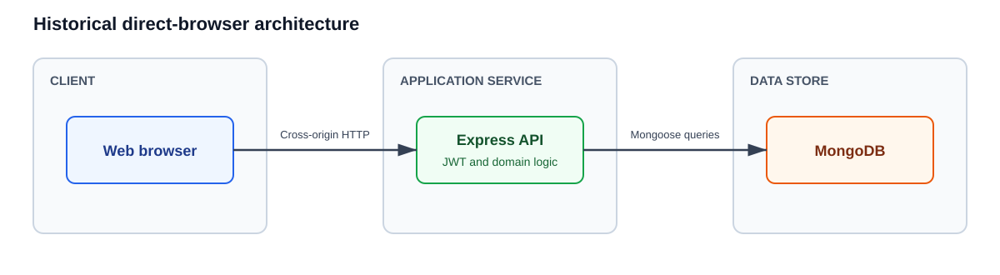
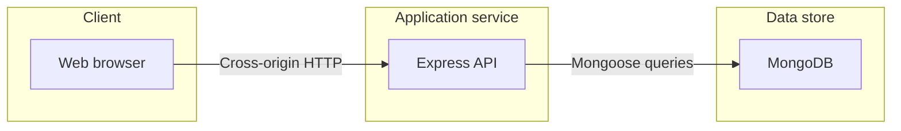
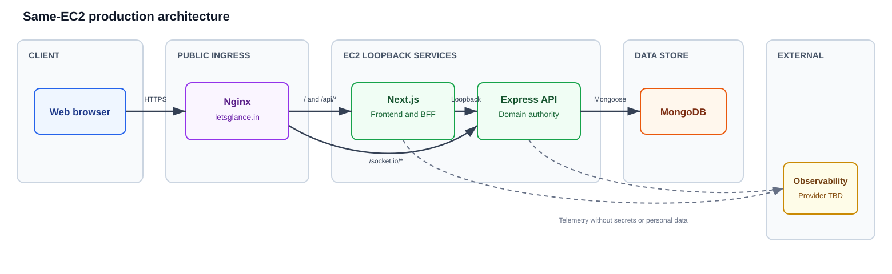
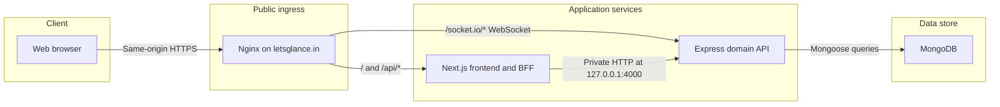
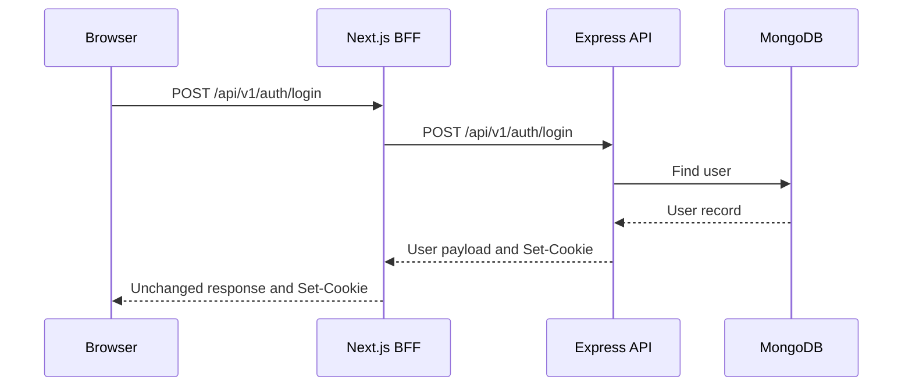
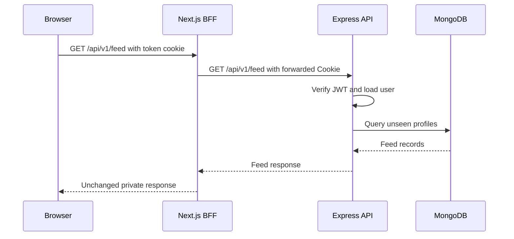

# Backend-for-Frontend Architecture

Status: implemented frontend boundary with a same-EC2 production topology.

## Purpose

The Next.js Backend for Frontend (BFF) gives the browser a same-origin, frontend-specific API while the Express application remains the source of truth for authentication and connection-domain behavior.

The BFF is not a second domain backend. It owns transport concerns: secure cookie forwarding, response shaping, cache policy, request cancellation, timeout enforcement, error normalization, and frontend observability.

## Implemented same-origin BFF

One dynamic Next.js Route Handler forwards `/api/*` to the fixed private Express origin. It preserves the backend URL contract, so the browser and Express both use paths such as `/api/v1/auth/login`.

This implementation is intentionally transport-only: it does not accept a destination origin from the browser or duplicate domain rules. Production Nginx routes both `/` and `/api/*` to Next.js, so authentication cookies remain same-origin and the BFF boundary stays intact. Only `/socket.io/*` bypasses Next.js and reaches Express directly.

## Historical baseline

Mermaid source

Current backend behavior and constraints:

- Every Express endpoint is mounted under `/api/v1`; the API has no CORS middleware.
- Authentication uses an opaque JWT in the `token` HTTP-only cookie.
- The cookie uses `SameSite=Lax`, path `/`, and `Secure` only in production.
- The access token and cookie expire after one day; no refresh flow exists.
- Protected routes read and verify the cookie in Express.
- Typed application errors return 401, 403, 404, 409, 422, or 500 as appropriate.
- Logout uses `POST /logout`.

## Production architecture

Mermaid source

Nginx is the only public service. Next.js listens on `127.0.0.1:3000` and Express/Socket.IO listens on `127.0.0.1:4000`.

## Ownership boundaries

Next.js BFF owns:

- Same-origin browser API routes.
- Forwarding opaque authentication cookies and upstream `Set-Cookie` headers.
- Frontend-specific payload reduction and response contracts.
- Request IDs, timing headers, timeout budgets, cancellation, and error envelopes.
- Explicit browser and CDN cache headers.
- CSRF and origin checks for cookie-authenticated mutations.

Express owns:

- JWT creation and verification.
- User, profile, feed, connection, and authorization rules.
- Canonical validation and HTTP status codes.
- MongoDB access and domain transactions.
- Rate-limit identity and domain-level abuse controls.

The BFF must not decode the JWT, query MongoDB, or duplicate connection-domain decisions.

## Login sequence

Mermaid source

The browser stores the cookie for the frontend origin. It sends that cookie only to the BFF; the BFF forwards it to Express. Production requires HTTPS end to end.

## Authenticated feed sequence

Mermaid source

Feed data is personalized. It must not enter a shared CDN cache. Initial policy should be `private, no-store` until a measured private-cache design is approved.

## Failure and latency policy

- Assign or propagate one request ID across browser, BFF, and Express.
- Apply a configured end-to-end latency budget and cancel upstream work when the browser disconnects.
- Return a gateway timeout when Express exceeds its budget.
- Never retry login, signup, swipe, or connection mutations automatically.
- Retry safe reads only for explicitly classified transient failures and only within the original latency budget.
- Do not expose Express stack traces, secrets, or internal error details.
- Record BFF duration, upstream duration, status, route, cache result, and response size without logging tokens or personal data.

## Required backend corrections

Before production integration:

- Define refresh or reauthentication behavior for the one-day token expiry.
- Add abuse protection and rate limiting at appropriate ingress and backend boundaries.

## BFF proxy surface

- Browser requests preserve the Express path: `/api/v1/*`.
- The proxy supports GET, HEAD, POST, PUT, PATCH, and DELETE.
- The destination origin always comes from server-only `BACKEND_API_ORIGIN`.
- Nginx must route `/api/*` to Next.js, not directly to Express.

Future route-specific BFF endpoints must use explicit contracts and policies. The generic transport proxy can be narrowed as those explicit endpoints replace it.
